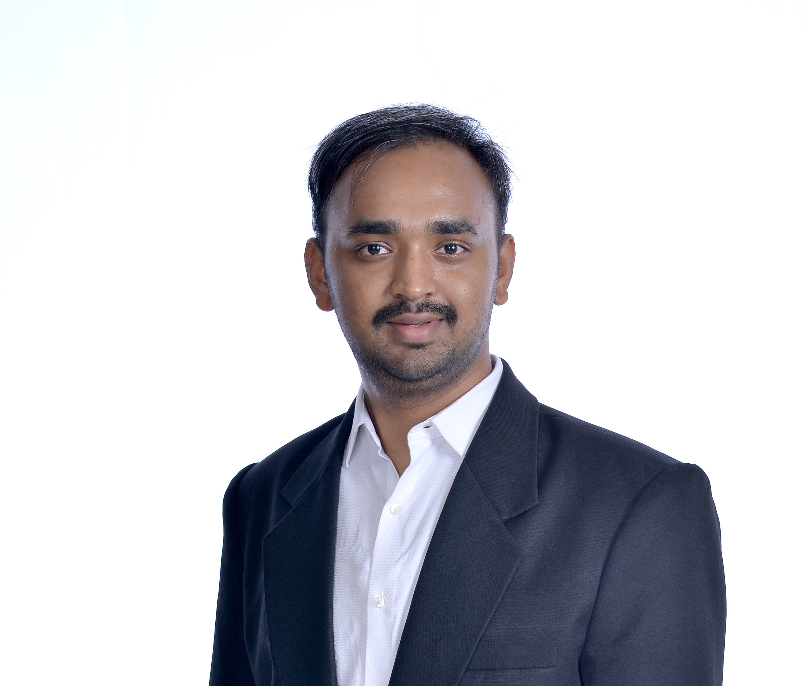

# Hitesh B  

Your text continues here, and will flow around the image if the CSS is set up to float.
Hello world! Welcome to my personal page.  

This is Hitesh and here is a brief intro about myself. I received my Bachelor's degree from NIT Karnataka in 2021 and my MSc in Electrical Engineering from NUS in 2024. I am now a full-time Teaching Assistant in the ECE department at NUS.

#### Teaching assignments:
* CS2040DE (AY 24/25 Sem 1 & Sem 2)  
* EE2022 (AY 24/25 Sem 2)  
* EE2211 (AY 24/25 Sem 2)  
* EE4502 (AY 24/25 Sem 1)  
* EE4503 (AY 24/25 Sem 2)

This page is still a work in progress. Stay tuned for more info !!! :)
